# Immigration Ops DB 기획서 및 ERD

작성일: 2026-05-11

## 1. 목적

이 문서는 `immigration-ops-frontend`의 더미 화면, 프론트/백엔드 `기획서.md`, 현재 백엔드 OCR 처리 구조를 기준으로 1차 DB 설계 초안을 정리한다.

현재 서비스의 핵심 업무 단위는 `학생`이 아니라 `신청 케이스`다. 한 학생은 여러 비자 신청 건을 가질 수 있고, ZIP 업로드 1건 안에는 여러 학생/신청 케이스의 문서가 섞일 수 있다.

따라서 DB는 아래 흐름을 안정적으로 저장하는 것을 목표로 한다.

```text
ZIP 업로드
  -> 원본 ZIP 보관
  -> OCR/Python 작업 실행
  -> 통합신청서 기준 학생 구간 분리
  -> 문서 유형 분류
  -> 학생/신청 케이스 매핑
  -> 개별 이미지 및 결과 manifest 저장
  -> Spring이 RDS에 최종 반영
```

## 2. 설계 기준

- `student`와 `application_case`는 분리한다. 같은 학생이 여러 신청 건을 가질 수 있기 때문이다.
- `visa_type`, `document_type`, `visa_document_requirement`는 기준 데이터로 둔다. 비자 유형별 필요 서류가 다르기 때문이다.
- `case_document_requirement`는 케이스 생성 시점의 필요 서류 스냅샷이다. 나중에 비자 요건이 바뀌어도 기존 케이스의 제출 판단이 흔들리지 않게 하기 위함이다.
- `upload_batch`는 ZIP 업로드 단위다. ZIP 1개가 여러 학생 구간과 여러 케이스로 분리될 수 있으므로 케이스와 직접 1:1로 묶지 않는다.
- `submitted_document`는 특정 케이스에 제출된 논리 문서다. 실제 페이지 이미지나 원본 파일은 `document_file`에 별도로 저장한다.
- OCR 원문과 추출 필드는 `ocr_result`, `ocr_extracted_field`에 분리한다. 정규화된 학생 정보와 OCR 근거를 분리해야 검수와 재처리가 가능하다.
- 파일 바이너리는 DB에 넣지 않는다. S3 key 또는 로컬 저장 경로만 DB에 저장한다.

## 3. 주요 상태값

### application_case.status

| 값 | 의미 |
| --- | --- |
| `DRAFT` | 케이스 생성 전 임시 상태 |
| `SUBMITTED` | 신청 접수됨 |
| `RECEIVED` | 운영자가 접수 확인함 |
| `NEEDS_REVIEW` | OCR 결과 또는 서류 상태에 운영자 검수가 필요함 |
| `NEEDS_SUPPLEMENT` | 필수 서류 누락 또는 보완 요청 상태 |
| `COMPLETED` | 필수 서류와 주요 필드 검토 완료 |
| `REJECTED` | 반려 |

프론트 1차 화면의 `보완`은 `NEEDS_SUPPLEMENT`, `완료`는 `COMPLETED`로 매핑한다.

### upload_batch.status

| 값 | 의미 |
| --- | --- |
| `UPLOADED` | 원본 ZIP 저장 완료 |
| `VALIDATING` | ZIP 구조 검증 중 |
| `RUNNING` | OCR/Python 작업 실행 중 |
| `RESULT_UPLOADED` | Python이 manifest/result 업로드 완료 |
| `FINALIZING` | Spring이 manifest를 읽어 DB 반영 중 |
| `COMPLETED` | 배치 처리 완료 |
| `NEEDS_REVIEW` | 일부 구간/문서에 검수 필요 |
| `FAILED` | 처리 실패 |

### case_document_requirement.status

| 값 | 의미 |
| --- | --- |
| `NOT_SUBMITTED` | 아직 제출 문서 없음 |
| `SUBMITTED` | 제출됨 |
| `NEEDS_REVIEW` | 검수 필요 |
| `NEEDS_SUPPLEMENT` | 보완 필요 |
| `APPROVED` | 검토 완료 |

### processing_job.status

| 값 | 의미 |
| --- | --- |
| `QUEUED` | 실행 요청 전 또는 대기 |
| `RUNNING` | ECS RunTask, AWS Batch, 또는 worker 작업 중 |
| `SUCCEEDED` | 작업 성공 |
| `FAILED` | 작업 실패 |
| `CANCELLED` | 작업 취소 |

## 4. ERD

```mermaid
erDiagram
    ORGANIZATION ||--o{ APP_USER : has
    ORGANIZATION ||--o{ STUDENT : school_students
    ORGANIZATION ||--o{ STUDENT : agency_students
    ORGANIZATION ||--o{ APPLICATION_CASE : school_cases
    ORGANIZATION ||--o{ APPLICATION_CASE : agency_cases

    STUDENT ||--o{ APPLICATION_CASE : applies
    VISA_TYPE ||--o{ APPLICATION_CASE : selected_for
    VISA_TYPE ||--o{ VISA_DOCUMENT_REQUIREMENT : defines
    DOCUMENT_TYPE ||--o{ VISA_DOCUMENT_REQUIREMENT : required_as

    APPLICATION_CASE ||--o{ CASE_DOCUMENT_REQUIREMENT : snapshots
    VISA_DOCUMENT_REQUIREMENT ||--o{ CASE_DOCUMENT_REQUIREMENT : snapshotted_as
    DOCUMENT_TYPE ||--o{ CASE_DOCUMENT_REQUIREMENT : requirement_type
    CASE_DOCUMENT_REQUIREMENT ||--o{ SUBMITTED_DOCUMENT : fulfilled_by
    APPLICATION_CASE ||--o{ SUBMITTED_DOCUMENT : contains
    DOCUMENT_TYPE ||--o{ SUBMITTED_DOCUMENT : classified_as

    UPLOAD_BATCH ||--o{ PROCESSING_JOB : executes
    UPLOAD_BATCH ||--o{ UPLOAD_BATCH_SEGMENT : splits_into
    UPLOAD_BATCH ||--o{ SUBMITTED_DOCUMENT : produced_documents
    UPLOAD_BATCH_SEGMENT ||--o{ SUBMITTED_DOCUMENT : segment_documents
    APPLICATION_CASE ||--o{ UPLOAD_BATCH_SEGMENT : matched_case

    SUBMITTED_DOCUMENT ||--o{ DOCUMENT_FILE : has_files
    SUBMITTED_DOCUMENT ||--o{ OCR_RESULT : has_ocr
    OCR_RESULT ||--o{ OCR_EXTRACTED_FIELD : extracts

    APPLICATION_CASE ||--o{ REVIEW_TASK : case_reviews
    SUBMITTED_DOCUMENT ||--o{ REVIEW_TASK : document_reviews
    OCR_EXTRACTED_FIELD ||--o{ REVIEW_TASK : field_reviews
    REVIEW_TASK ||--o{ REVIEW_CORRECTION : corrections

    APP_USER ||--o{ UPLOAD_BATCH : uploads
    APP_USER ||--o{ REVIEW_TASK : assigned_reviews
    APP_USER ||--o{ REVIEW_CORRECTION : corrects
    APP_USER ||--o{ AUDIT_EVENT : creates

    ORGANIZATION {
        bigint id PK
        string type
        string name
        string business_registration_no
        string contact_email
        string contact_phone
        datetime created_at
        datetime updated_at
    }

    APP_USER {
        bigint id PK
        bigint organization_id FK
        string role
        string username
        string password_hash
        string display_name
        string status
        datetime last_login_at
        datetime created_at
        datetime updated_at
    }

    STUDENT {
        bigint id PK
        bigint school_id FK
        bigint agency_id FK
        string name
        string nationality
        date birth_date
        string passport_number
        string alien_registration_number
        string phone_number
        string address
        datetime created_at
        datetime updated_at
    }

    APPLICATION_CASE {
        bigint id PK
        bigint student_id FK
        bigint school_id FK
        bigint agency_id FK
        bigint visa_type_id FK
        string application_kind
        string status
        date application_date
        string intake_batch
        string coordinator_name
        int submitted_document_count
        int missing_document_count
        datetime created_at
        datetime updated_at
    }

    VISA_TYPE {
        bigint id PK
        string code
        string name
        string description
        boolean active
        datetime created_at
        datetime updated_at
    }

    DOCUMENT_TYPE {
        bigint id PK
        string code
        string name
        string category
        string review_rule
        boolean active
        datetime created_at
        datetime updated_at
    }

    VISA_DOCUMENT_REQUIREMENT {
        bigint id PK
        bigint visa_type_id FK
        bigint document_type_id FK
        boolean required
        int display_order
        string note
        datetime created_at
        datetime updated_at
    }

    CASE_DOCUMENT_REQUIREMENT {
        bigint id PK
        bigint application_case_id FK
        bigint document_type_id FK
        bigint source_requirement_id FK
        boolean required
        int display_order
        string status
        datetime created_at
        datetime updated_at
    }

    UPLOAD_BATCH {
        bigint id PK
        bigint uploaded_by_user_id FK
        string original_filename
        string raw_zip_s3_key
        string raw_zip_checksum
        long raw_zip_size_bytes
        string status
        int detected_student_count
        string result_manifest_s3_key
        string result_json_s3_key
        string failure_reason
        datetime uploaded_at
        datetime completed_at
        datetime created_at
        datetime updated_at
    }

    PROCESSING_JOB {
        bigint id PK
        bigint upload_batch_id FK
        string job_type
        string status
        string external_job_id
        int attempt_no
        datetime requested_at
        datetime started_at
        datetime finished_at
        string error_code
        string error_message
    }

    UPLOAD_BATCH_SEGMENT {
        bigint id PK
        bigint upload_batch_id FK
        bigint application_case_id FK
        int segment_order
        int start_page_no
        int end_page_no
        string detected_student_name
        string detected_passport_number
        string match_status
        double match_confidence
        datetime created_at
        datetime updated_at
    }

    SUBMITTED_DOCUMENT {
        bigint id PK
        bigint application_case_id FK
        bigint case_requirement_id FK
        bigint upload_batch_id FK
        bigint batch_segment_id FK
        bigint document_type_id FK
        string status
        string review_status
        double classification_confidence
        double extraction_confidence
        string preview_label
        datetime submitted_at
        datetime created_at
        datetime updated_at
    }

    DOCUMENT_FILE {
        bigint id PK
        bigint submitted_document_id FK
        string file_role
        string storage_provider
        string storage_key
        string media_type
        long size_bytes
        string checksum
        int page_no
        int page_count
        datetime created_at
    }

    OCR_RESULT {
        bigint id PK
        bigint submitted_document_id FK
        string provider
        string provider_model
        string full_text_s3_key
        double confidence
        json raw_response
        datetime created_at
    }

    OCR_EXTRACTED_FIELD {
        bigint id PK
        bigint ocr_result_id FK
        string field_name
        string field_value
        string source_document_type
        double confidence
        boolean selected_for_normalized_value
        datetime created_at
        datetime updated_at
    }

    REVIEW_TASK {
        bigint id PK
        bigint application_case_id FK
        bigint submitted_document_id FK
        bigint ocr_extracted_field_id FK
        bigint assigned_user_id FK
        string status
        string reason_code
        string reason_message
        datetime created_at
        datetime resolved_at
    }

    REVIEW_CORRECTION {
        bigint id PK
        bigint review_task_id FK
        string field_name
        string before_value
        string after_value
        bigint corrected_by_user_id FK
        datetime corrected_at
    }

    AUDIT_EVENT {
        bigint id PK
        bigint actor_user_id FK
        string action
        string target_type
        string target_id
        json metadata
        datetime created_at
    }
```



## 5. 테이블 기획

### 5-1. organization

학교와 유학원을 함께 관리한다.

| 컬럼 | 설명 |
| --- | --- |
| `id` | 조직 식별자 |
| `type` | `SCHOOL`, `AGENCY` |
| `name` | 학교명 또는 유학원명 |
| `business_registration_no` | 사업자번호, 필요 시 사용 |
| `contact_email`, `contact_phone` | 대표 연락처 |

### 5-2. app_user

운영자 계정이다. SQL 예약어 충돌을 피하기 위해 `user` 대신 `app_user`를 사용한다.

| 컬럼 | 설명 |
| --- | --- |
| `organization_id` | 소속 학교 또는 유학원 |
| `role` | `STUDENT`, `SCHOOL_ADMIN`, `AGENCY_ADMIN`, `REVIEWER`, `SYSTEM_ADMIN` |
| `username` | 학교/유학원 로그인 ID |
| `password_hash` | 비밀번호 해시 |
| `display_name` | 화면 표시 이름 |
| `status` | `ACTIVE`, `LOCKED`, `DISABLED` |

학생 로그인은 1차 화면 기준 `국적 + 여권번호 + 생년월일` 조회형 인증에 가깝다. 실제 계정으로 승격하기 전까지는 `student` 조회 API로 처리하고, 외부 공개 전에는 별도 인증 정책을 다시 정해야 한다.

### 5-3. student

학생 마스터다. OCR 결과로 값이 보완될 수 있다.

| 컬럼 | 설명 |
| --- | --- |
| `school_id` | 현재 화면의 학교 소속 |
| `agency_id` | 담당 유학원, 직접 신청이면 null 가능 |
| `name` | 학생명 |
| `nationality` | 국적 |
| `birth_date` | 생년월일 |
| `passport_number` | 여권번호 |
| `alien_registration_number` | 외국인등록번호 |
| `phone_number` | 전화번호 |
| `address` | 체류지 주소 |

학생 식별은 1차로 `passport_number + birth_date`를 사용한다. 단, 여권 갱신이나 OCR 오인식이 있을 수 있으므로 운영자 병합/수정 기능을 나중에 고려한다.

### 5-4. application_case

실제 운영의 중심 테이블이다.

| 컬럼 | 설명 |
| --- | --- |
| `student_id` | 신청 학생 |
| `school_id` | 신청 기준 학교 |
| `agency_id` | 대리 접수 유학원 |
| `visa_type_id` | 비자 유형 |
| `application_kind` | `NEW`, `EXTENSION`, `CHANGE`, `CHANGE_AND_EXTENSION` |
| `status` | 신청 상태 |
| `application_date` | 신청일 |
| `intake_batch` | 프론트의 `2026 봄학기 / 학부` 같은 운영 묶음 |
| `coordinator_name` | 유학원 담당자명 |
| `submitted_document_count` | 목록 조회용 캐시 |
| `missing_document_count` | 목록 조회용 캐시 |

`submitted_document_count`, `missing_document_count`는 `case_document_requirement` 기준으로 재계산 가능하지만, 유학원 대시보드 성능을 위해 캐시 컬럼으로 둘 수 있다.

### 5-5. visa_type

비자 유형 기준 데이터다.

초기 seed 후보:

| code | name |
| --- | --- |
| `ALIEN_REGISTRATION` | 외국인등록 |
| `D2_EXTENSION` | D2연장 |
| `D4_EXTENSION` | D4연장 |
| `STATUS_CHANGE_AND_EXTENSION` | 세부체류자격 변경 및 연장 |
| `D2_CHANGE` | D2변경 |

### 5-6. document_type

문서 유형 기준 데이터다.

초기 seed 후보:

| code | name | category |
| --- | --- | --- |
| `APPLICATION_FORM` | 통합신청서 | 신청 |
| `PASSPORT_COPY` | 여권사본 | 신원 |
| `VISA_ISSUANCE_CERTIFICATE` | 사증발급서 | 비자 |
| `ENROLLMENT_CERTIFICATE` | 재학증명서 | 학교 |
| `REAL_ESTATE_CONTRACT` | 부동산계약서 | 거주 |
| `ALIEN_REGISTRATION_CARD_COPY` | 외국인등록증 사본 | 신분 |
| `ATTENDANCE_CERTIFICATE` | 출석증명서 | 학교 |
| `BANK_BALANCE_CERTIFICATE` | 은행잔고증명서 | 재정 |
| `REASON_STATEMENT` | 사유서 | 보완 |
| `POWER_OF_ATTORNEY` | 위임장 | 대리 |
| `ADVISOR_CONFIRMATION` | 지도교수 확인서 | 학교 |
| `STANDARD_ADMISSION_LETTER` | 표준입학허가서 | 학교 |
| `TUITION_PAYMENT_CONFIRMATION` | 등록금납부확인서 | 재정 |
| `FINAL_EDUCATION_CERTIFICATE` | 최종학력 인증서 | 학력 |
| `FINAL_TRANSCRIPT` | 최종학력 성적표 | 학력 |
| `LANGUAGE_SCHOOL_ENROLLMENT` | 어학당 재학증명서 | 학교 |
| `LANGUAGE_SCHOOL_TRANSCRIPT` | 어학당 성적증명서 | 학교 |

현재 백엔드 `DocumentType` enum은 기능 검증용 문서 분류 코드라 프론트의 실제 서류 목록보다 좁다. 운영 DB 기준으로는 위 `document_type` seed에 맞춰 확장하는 것이 좋다.

### 5-7. visa_document_requirement

비자 유형별 필요 서류 템플릿이다.

| 컬럼 | 설명 |
| --- | --- |
| `visa_type_id` | 비자 유형 |
| `document_type_id` | 필요 문서 |
| `required` | 필수 여부 |
| `display_order` | 화면 표시 순서 |
| `note` | 운영 메모 |

초기 데이터는 프론트 `visaDocumentMap`과 기획서의 비자 유형별 필요 서류 목록을 그대로 사용한다.

### 5-8. case_document_requirement

특정 신청 케이스의 필요 서류 상태다.

| 컬럼 | 설명 |
| --- | --- |
| `application_case_id` | 신청 케이스 |
| `document_type_id` | 필요 문서 |
| `source_requirement_id` | 원본 템플릿 row |
| `required` | 케이스 생성 시점의 필수 여부 |
| `display_order` | 화면 표시 순서 |
| `status` | `NOT_SUBMITTED`, `SUBMITTED`, `NEEDS_REVIEW`, `NEEDS_SUPPLEMENT`, `APPROVED` |

프론트 상세 화면의 `제출`, `미제출`은 이 테이블에서 계산한다.

### 5-9. upload_batch

ZIP 업로드 단위다.

| 컬럼 | 설명 |
| --- | --- |
| `uploaded_by_user_id` | 업로드한 유학원/학교 운영자 |
| `original_filename` | 원본 파일명 |
| `raw_zip_s3_key` | 원본 ZIP 저장 위치 |
| `raw_zip_checksum` | 중복/무결성 확인용 checksum |
| `raw_zip_size_bytes` | 원본 크기 |
| `status` | 배치 상태 |
| `detected_student_count` | Python이 분리한 학생 구간 수 |
| `result_manifest_s3_key` | Python manifest 위치 |
| `result_json_s3_key` | OCR/매핑 요약 결과 위치 |
| `failure_reason` | 실패 사유 |

원본 ZIP은 재처리를 위해 남긴다. 비용이 걱정되면 S3 lifecycle로 7일 또는 30일 후 삭제 정책을 둔다.

### 5-10. processing_job

OCR/Python 작업 실행 이력이다. ECS RunTask, AWS Batch, SQS worker 중 어떤 방식으로 가도 대응할 수 있게 외부 작업 ID를 문자열로 둔다.

| 컬럼 | 설명 |
| --- | --- |
| `upload_batch_id` | 대상 배치 |
| `job_type` | `OCR_BATCH`, `REPROCESS`, `FINALIZE` |
| `status` | 작업 상태 |
| `external_job_id` | ECS taskArn, AWS Batch jobId, SQS messageId 등 |
| `attempt_no` | 재시도 횟수 |
| `error_code`, `error_message` | 실패 정보 |

### 5-11. upload_batch_segment

ZIP 내부에서 `통합신청서` 기준으로 나뉜 학생 구간이다.

| 컬럼 | 설명 |
| --- | --- |
| `upload_batch_id` | 원본 ZIP 배치 |
| `application_case_id` | 매핑된 신청 케이스, 미확정이면 null |
| `segment_order` | ZIP 내부 학생 구간 순서 |
| `start_page_no`, `end_page_no` | 전체 스캔 기준 페이지 범위 |
| `detected_student_name` | OCR 추정 학생명 |
| `detected_passport_number` | OCR 추정 여권번호 |
| `match_status` | `MATCHED`, `NEW_CASE_CREATED`, `AMBIGUOUS`, `UNMATCHED` |
| `match_confidence` | 학생/케이스 매칭 신뢰도 |

프론트 업로드 내역 상세의 스캔본 미리보기와 학생 구간 분리 결과를 이 테이블로 표현한다.

### 5-12. submitted_document

신청 케이스에 제출된 논리 문서다.

| 컬럼 | 설명 |
| --- | --- |
| `application_case_id` | 신청 케이스 |
| `case_requirement_id` | 어떤 필요 서류를 충족하는지 |
| `upload_batch_id` | 어떤 ZIP에서 나왔는지 |
| `batch_segment_id` | 어떤 학생 구간에서 나왔는지 |
| `document_type_id` | 분류된 문서 유형 |
| `status` | `SUBMITTED`, `NEEDS_REVIEW`, `REJECTED`, `APPROVED` |
| `review_status` | 검수 상태 |
| `classification_confidence` | 문서 분류 신뢰도 |
| `extraction_confidence` | 필드 추출 신뢰도 |
| `preview_label` | 화면 표시용 요약 |
| `submitted_at` | 제출 시각 |

문서가 여러 페이지 이미지로 구성될 수 있으므로 실제 파일은 `document_file`에 둔다.

### 5-13. document_file

개별 이미지, PDF, preview, crop 같은 파일 산출물이다.

| 컬럼 | 설명 |
| --- | --- |
| `submitted_document_id` | 연결된 제출 문서 |
| `file_role` | `PAGE_IMAGE`, `ORIGINAL_EXTRACTED`, `PREVIEW`, `CROP` |
| `storage_provider` | `S3`, `LOCAL` |
| `storage_key` | S3 key 또는 로컬 경로 |
| `media_type` | MIME type |
| `size_bytes` | 파일 크기 |
| `checksum` | 무결성 확인용 |
| `page_no` | 문서 내 페이지 번호 |
| `page_count` | 전체 페이지 수 |

Python이 ZIP을 풀고 OCR/분류 후 최종 폴더 구조로 이미지를 올리면, Spring은 manifest를 읽어 이 테이블에 S3 key를 저장한다.

권장 S3 key 예시:

```text
raw/{batchId}/source.zip
processed/{batchId}/manifest.json
processed/{batchId}/result.json
processed/{batchId}/submissions/{caseId}/{documentTypeCode}/page-001.jpg
processed/{batchId}/needs-review/{segmentId}/page-003.jpg
```

### 5-14. ocr_result

문서 OCR 실행 결과다.

| 컬럼 | 설명 |
| --- | --- |
| `submitted_document_id` | 대상 제출 문서 |
| `provider` | `OPENAI`, `GOOGLE_VISION`, `STUB` |
| `provider_model` | 모델명 또는 OCR 엔진 버전 |
| `full_text_s3_key` | 긴 OCR 원문 저장 위치 |
| `confidence` | 전체 신뢰도 |
| `raw_response` | 공급자 원본 응답 JSON |

OCR 원문은 길어질 수 있으므로 DB text로 직접 넣기보다 S3에 저장하고 key만 보관하는 방식을 우선 권장한다. 초기 개발 단계에서는 text 컬럼으로 시작해도 되지만 운영 전에는 분리하는 편이 안전하다.

### 5-15. ocr_extracted_field

OCR에서 추출된 필드 단위 결과다.

| 컬럼 | 설명 |
| --- | --- |
| `ocr_result_id` | OCR 결과 |
| `field_name` | `studentName`, `nationality`, `birthDate`, `address` 등 |
| `field_value` | 추출값 |
| `source_document_type` | 추출 출처 문서 유형 |
| `confidence` | 필드 신뢰도 |
| `selected_for_normalized_value` | 학생/케이스 정규화 값으로 채택됐는지 |

필드 우선순위는 현재 기획서 기준으로 아래처럼 둔다.

| 필드 | 1순위 | 보완 |
| --- | --- | --- |
| 학생명 | 여권사본 | 통합신청서 |
| 국적 | 여권사본 | 통합신청서 |
| 생년월일 | 여권사본 | 통합신청서 |
| 외국인등록번호 | 통합신청서 | 운영자 확인 |
| 전화번호 | 통합신청서 | 운영자 확인 |
| 주소 | 부동산계약서 | 운영자 확인 |

### 5-16. review_task

운영자 검수 작업이다.

| 컬럼 | 설명 |
| --- | --- |
| `application_case_id` | 케이스 기준 검수 |
| `submitted_document_id` | 문서 기준 검수 |
| `ocr_extracted_field_id` | 필드 기준 검수 |
| `assigned_user_id` | 담당자 |
| `status` | `OPEN`, `IN_PROGRESS`, `RESOLVED`, `DISMISSED` |
| `reason_code` | `LOW_CONFIDENCE`, `MISSING_REQUIRED_DOCUMENT`, `AMBIGUOUS_STUDENT_MATCH`, `UNKNOWN_DOCUMENT_TYPE` 등 |
| `reason_message` | 화면 표시용 사유 |

### 5-17. review_correction

검수자가 실제로 수정한 값이다. 나중에 OCR 품질 개선 데이터로 사용할 수 있다.

| 컬럼 | 설명 |
| --- | --- |
| `review_task_id` | 검수 작업 |
| `field_name` | 수정 필드 |
| `before_value` | 수정 전 |
| `after_value` | 수정 후 |
| `corrected_by_user_id` | 수정자 |

### 5-18. audit_event

민감 정보가 많은 시스템이므로 조회/다운로드/승인/재처리 이벤트를 남긴다.

| 컬럼 | 설명 |
| --- | --- |
| `actor_user_id` | 수행자 |
| `action` | `VIEW_CASE`, `DOWNLOAD_FILE`, `APPROVE_DOCUMENT`, `REPROCESS_BATCH` 등 |
| `target_type`, `target_id` | 대상 |
| `metadata` | 부가 정보, 여권번호 등 PII 원문은 저장하지 않는다 |

## 6. 프론트 화면과 DB 매핑

### 학생 로그인

입력값:

- 국적
- 여권번호
- 생년월일

조회 기준:

- `student.nationality`
- `student.passport_number`
- `student.birth_date`

응답 화면:

- `application_case`
- `visa_type`
- `case_document_requirement`
- `submitted_document`

### 학교 학생 목록

화면 컬럼:

- 학생명: `student.name`
- 국적: `student.nationality`
- 신청 유형: `application_case.application_kind`
- 비자 타입: `visa_type.name`
- 상태: `application_case.status`
- 소속: 학교 조직 또는 학과 확장 컬럼
- 유학원: `organization.name`
- 최근 갱신: `application_case.updated_at`

### 유학원 신청 대시보드

화면 컬럼:

- 학생명, 국적: `student`
- 학교명: `organization(type=SCHOOL)`
- 신청 유형, 신청일, 상태: `application_case`
- 미제출 개수: `application_case.missing_document_count`
- 담당자: `application_case.coordinator_name`

### 유학원 신청 상세

좌측 필요 문서 목록:

- `case_document_requirement`
- `document_type`
- `submitted_document`

우측 미리보기:

- `submitted_document.preview_label`
- `document_file.storage_key`
- `ocr_extracted_field`
- `review_task`

### ZIP 업로드 내역

배치 목록:

- `upload_batch`
- `processing_job`

배치 상세:

- `upload_batch_segment`
- `submitted_document`
- `document_file`

## 7. ZIP/OCR manifest 반영 방식

Python 작업은 S3에 `manifest.json`을 먼저 저장하고 Spring callback을 호출한다. Spring은 callback payload만 믿지 말고 manifest를 직접 읽어서 DB에 반영한다.

권장 manifest 구조:

```json
{
  "batch_id": "BATCH-2026-0414-A",
  "source_zip_key": "raw/BATCH-2026-0414-A/source.zip",
  "status": "COMPLETED",
  "segments": [
    {
      "segment_order": 1,
      "start_page_no": 1,
      "end_page_no": 4,
      "detected_student": {
        "name": "린응옥안",
        "nationality": "베트남",
        "birth_date": "2002-11-14",
        "passport_number": "M38492017"
      },
      "match": {
        "application_case_id": 1001,
        "status": "MATCHED",
        "confidence": 0.94
      },
      "documents": [
        {
          "document_type_code": "APPLICATION_FORM",
          "classification_confidence": 0.91,
          "extraction_confidence": 0.88,
          "status": "SUBMITTED",
          "files": [
            {
              "file_role": "PAGE_IMAGE",
              "storage_key": "processed/BATCH-2026-0414-A/submissions/1001/APPLICATION_FORM/page-001.jpg",
              "media_type": "image/jpeg",
              "page_no": 1
            }
          ],
          "fields": [
            {
              "field_name": "phoneNumber",
              "field_value": "010-1234-5678",
              "confidence": 0.86
            }
          ]
        }
      ]
    }
  ]
}
```

## 8. 인덱스와 제약 조건 초안

| 대상 | 권장 제약/인덱스 |
| --- | --- |
| `app_user.username` | unique |
| `student.passport_number, student.birth_date` | index, 중복 가능성은 운영자 병합으로 처리 |
| `application_case.student_id, application_case.status` | index |
| `application_case.agency_id, application_case.status, application_case.updated_at` | 유학원 대시보드 조회용 index |
| `visa_type.code` | unique |
| `document_type.code` | unique |
| `visa_document_requirement.visa_type_id, document_type_id` | unique |
| `case_document_requirement.application_case_id, document_type_id` | unique |
| `upload_batch.status, upload_batch.created_at` | 배치 목록/재처리 조회용 index |
| `processing_job.upload_batch_id, attempt_no` | unique |
| `submitted_document.application_case_id, document_type_id` | index |
| `document_file.submitted_document_id, page_no` | index |
| `review_task.status, review_task.created_at` | 검수 큐 조회용 index |

## 9. 1차 구현 순서

1. `visa_type`, `document_type`, `visa_document_requirement` seed부터 만든다.
2. `student`, `application_case`, `case_document_requirement`를 먼저 구현한다.
3. 프론트 더미 목록을 `application_case` 조회 API로 대체한다.
4. ZIP 업로드를 `upload_batch`로 저장한다.
5. Python 작업 결과 manifest를 기준으로 `upload_batch_segment`, `submitted_document`, `document_file`, `ocr_result`, `ocr_extracted_field`를 저장한다.
6. 검수 필요 항목을 `review_task`로 생성한다.
7. 대시보드 카운트와 상태 계산을 `case_document_requirement` 기준으로 정리한다.

## 10. 현재 코드와의 연결 메모

현재 백엔드는 `SubmissionDocument` 중심으로 단일 파일 업로드, OCR, 문서 분류, 검수 필요 여부 판단을 수행한다.

운영 도메인으로 확장할 때는 아래처럼 역할을 나누는 것이 좋다.

| 현재 코드 | 운영 DB 확장 방향 |
| --- | --- |
| `SubmissionDocument` | `submitted_document` |
| `DocumentType` enum | `document_type` 기준 데이터로 확장 |
| `DocumentStatus` | `submitted_document.status`, `case_document_requirement.status`로 분리 |
| `OcrResult` | `ocr_result`, `ocr_extracted_field` |
| `ReviewTask` record | `review_task`, `review_correction` |
| `LocalFileStorage` | `document_file.storage_provider/storage_key`, S3 저장소로 확장 |

지금 바로 모든 테이블을 JPA로 구현할 필요는 없다. 먼저 `application_case` 중심의 조회 모델과 `visa_document_requirement` seed를 잡고, OCR batch 저장 구조는 Python manifest 형태가 확정된 뒤 붙이는 편이 안정적이다.
